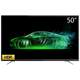

# 淘宝项目经验

# 基本结构与样式

> 样式重置：reset.css

> 结构分层：自上而下，从左往右

font:复合属性

> 行高：

```CSS
line-height: normal;
/* 默认normal 
normal多大?
两个因素决定：浏览器和字体
微软雅黑不同浏览器大概1.32
宋体不同浏览器大概1.41
*/
line-height: 1.5;
line-height: 200%;
line-height: 50px;
line-height: 5em;
/* 以上只有px为固定值，其他相对单位：拿自己的值与font-size进行相乘 */
p {
    line-height: 1.5;
    /* 默认16px ：1.5*16px*/
}
```

以上来看，用哪个呢？

大型互联网公司一般用数字

继承细节：如果数字，子元素都会继承line-height值

如果是其他(150%):继承150%*自己的font-size值

> unicode:

```CSS
\5b8b\4f53：字符集(万国码)
强大之处：为每一种语言中的每一个字符设置了一个唯一的二进制编码，跨平台，跨语言
\5b8b\4f53——宋体
前后端数据交互不允许出现中文
关于宋体
font-family:'宋体';
font-family:'\5b8b\4f53';
font-family:SimSun;
font-family:"微软雅黑";
font-family:Microsoft YaHei;
```

引入文件

- 外部css文件

- 模块化

  @规则

  > @charset 设置样式表的编码 @charset 'utf-8'

  > @import 导入其他样式文件 @import "reset.css";

  > @media 媒体查询 移动端适配

  > @font-face 自定义字体

# 头部信息结构

base标签：定义一个文档当中包含所有相对url的根目录

```HTML
<base href="https://www.baidu.com">
<a href="#">百度</a>
```

```HTML
<base target="_blank">
```

format

性能优化，这个格式存在，后面字体格式万一不认识就不加载了

SEO爬虫：标签不要套太深

解决：同级展示

```HTML
<li class="item1">
    <a href="#" class="fr">
        
    </a>
    <h3><a href="#">电视会场</a></h3>
    <p><a href="#">最高降2000</a></p>
</li>
```

h3标签：

标签权重：

title >  h1 > >>> h6

h1:用于大标题和以图换字。一个页面h1只能出现一次

h2:用于副标题和一小模块的主题

h3:页面当中板块标题

> 行内及不能包括块级元素:兼顾移动端触屏

```HTML
<li class="item1">
    <a href="">
        <a href="#" class="fr">
            
        </a>
        <h3><a href="#">电视会场</a></h3>
        <p><a href="#">最高降2000</a></p>
    </a>
</li>
```

# 头部搜索结构与样式

左中右布局技巧7min

渐变

```CSS
background-image: linear-gradient(to right,#ff9000,#ff5000);
```

IE滤镜

```CSS
filter: progid:DXImageTransform.Microsoft.gradient(startColorstr='#ffff9000', endColorstr='#ffff5000', GradientType=1);
```

1是水平方向；0是垂直方向

照相机：**人工智能图像识别技术**

主题市场和十三列的两栏布局

普通方法：

```CSS
#nav ul{
    height: 30px;
    width: 1000px;
    width: calc(100% - 190px); 	/* 兼容情况：IE9+ */
    background-image: linear-gradient(to right,#ff9000,#ff5000);
    filter: progid:DXImageTransform.Microsoft.gradient(startColorstr='#ffff9000', endColorstr='#ffff5000', GradientType=1);
}
#nav ul li{
    float: left;
    line-height: 30px;
    margin: 0 7px;
    font-size: 14px;
    color: #fff;
    padding: 0 5px;
    position: relative;
}
```

进阶方法：不需要给右边固定宽度；浮动的特性（13min没懂）

```CSS
#nav ul{
    margin-left: 190px;
    overflow:hidden;/*触发BFC*/
    background-image: linear-gradient(to right,#ff9000,#ff5000);
    filter: progid:DXImageTransform.Microsoft.gradient(startColorstr='#ffff9000', endColorstr='#ffff5000', GradientType=1);
}
#nav ul li{
    float: left;
    line-height: 30px;
    margin: 0 7px;
    font-size: 14px;
    color: #fff;
    padding: 0 5px;
    position: relative;
}
```

首屏内容结构：布局经验

雪碧图

优点：内存减少；减少图片http请求

```CSS
div{
	background-position:
}
```

因为要居中，所以不能浮动

```CSS
.firstRight .notice .title {
    text-align: center;
    font-size: 0;
    padding-top: 10px;
}
.firstRight .notice .title li {
    display: inline-block;
}
```


